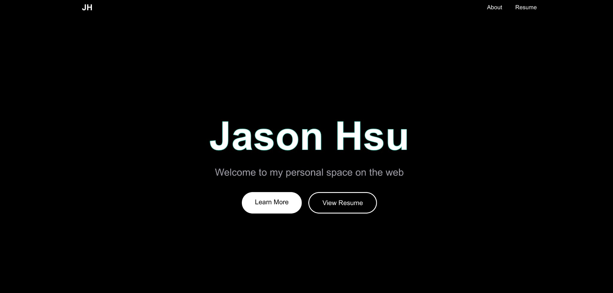
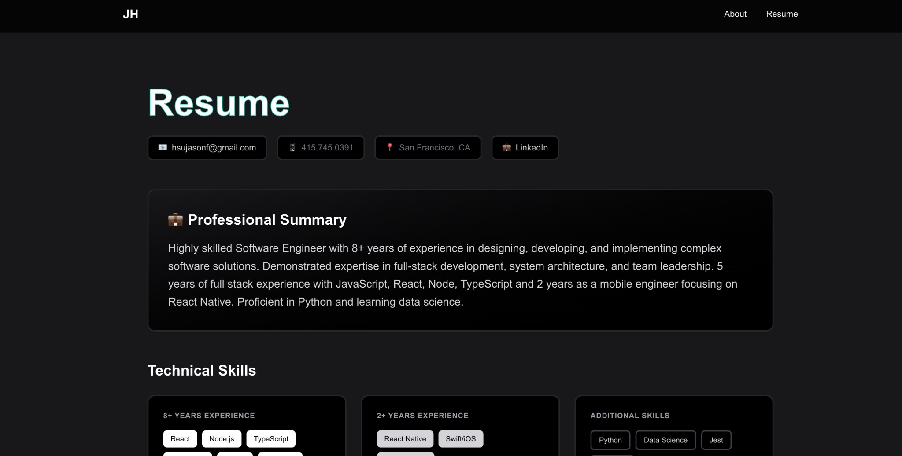

# Jason Hsu - Personal Website

My personal website and portfolio showcasing my work as a Software Engineer. Built with modern web technologies and featuring a clean, interactive design with teal accents.

## 🎨 Screenshots

### Landing Page


### Resume Section


## ✨ Features

- **Smooth Navigation** - Seamless scrolling between sections with a sticky navbar
- **Interactive Resume** - Click on work experiences to view detailed information in an expandable modal
- **Dark Mode Support** - Fully responsive design that adapts to your system preferences
- **Teal Accents** - Modern design with signature teal hover effects and outlines
- **Localized Content** - All text content organized in JSON files for easy updates
- **Modular Architecture** - Clean, maintainable component structure

## 🛠️ Tech Stack

- **Framework:** [Next.js 16](https://nextjs.org) (App Router)
- **Language:** TypeScript
- **Styling:** Tailwind CSS 4
- **Fonts:** Geist Sans & Geist Mono
- **Internationalization:** Custom i18n setup

## 📦 Project Structure

```
app/
├── components/          # Reusable UI components
│   ├── resume/         # Resume-specific components
│   ├── About.tsx
│   ├── Hero.tsx
│   ├── Navbar.tsx
│   └── Resume.tsx
├── globals.css         # Global styles and animations
├── layout.tsx          # Root layout
└── page.tsx            # Home page

messages/
└── en/
    └── resume.json     # Resume content (localized)

lib/
└── i18n.ts            # Internationalization utilities

public/                # Static assets (logos, images)
```

## 🚀 Getting Started

### Prerequisites
- Node.js 20+ 
- npm, yarn, pnpm, or bun

### Installation

1. Clone the repository
2. Install dependencies:

```bash
npm install
```

3. Run the development server:

```bash
npm run dev
```

4. Open [http://localhost:3000](http://localhost:3000) in your browser

## 📝 Updating Content

### Resume Information

Edit `messages/en/resume.json` to update:
- Contact information
- Professional summary
- Technical skills
- Work experience
- Achievements

No code changes needed - just update the JSON!

### Adding Work Experience

1. Add company logo to `public/`
2. Add product screenshot to `public/` (optional)
3. Add new entry to `messages/en/resume.json` under `experience.jobs`

See `LOCALIZATION.md` for detailed documentation.

## 🎯 Key Components

- **Hero** - Landing page with name and call-to-action buttons
- **About** - Introduction section
- **Resume** - Comprehensive resume with expandable work experience cards
- **Navbar** - Sticky navigation with smooth scroll
- **ExperienceModal** - Detailed view of work experiences with screenshots

## 🌐 Deployment

Built for deployment on [Vercel](https://vercel.com):

```bash
npm run build
```

## 📄 License

Personal project - All rights reserved.

## 👤 Contact

- **Email:** hsujasonf@gmail.com
- **LinkedIn:** [linkedin.com/in/jasonhsu90](https://linkedin.com/in/jasonhsu90)
- **Location:** San Francisco, CA
